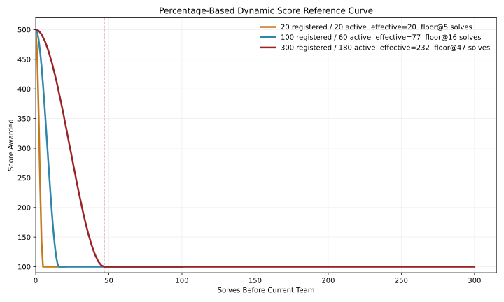

# Dynamic Score Plugin for CSCTF 2026

This plugin replaces CTFd's stock dynamic scoring with a model built around one
simple rule:

`a challenge should reach its minimum value after roughly X% of the effective field solves it`

It also preserves solve-time value permanently, so full-solvers no longer
collapse to the same final score.

## Recommended setup

- Use `function = logarithmic` for almost everything.
- Keep `initial = 500` and `minimum = 100` for a broad but readable spread.
- Treat `decay` as the percent of the effective field needed to hit minimum.
- Start with `decay = 20` for general use.

Examples:

- `decay = 20` means the challenge bottoms out at about `20%` of the effective field.
- `decay = 30` means it holds value longer and bottoms out at about `30%`.
- `decay = 10` makes it decay much faster.

## Effective field

The plugin does not use raw registrations directly, because registrations alone
can overestimate the real playing field early in the event.

For each dynamic challenge, the plugin freezes its calibration on first valid solve:

- `reference_accounts` = eligible teams/users at that moment
- `reference_active_accounts` = teams/users with at least one submission at that moment

Then it computes:

```text
effective_field = max(
  reference_active_accounts,
  round(sqrt(reference_accounts * reference_active_accounts))
)
```

bounded so it never exceeds registered eligible accounts.

This gives a field estimate that is:

- smaller than raw registration count when many teams are idle
- larger than raw active count when only a few teams have submitted early
- stable enough to freeze without causing the challenge value to rise later

## Algorithm

The target solve count is:

```text
target_percent = decay / 100
target_solves = max(
  min(5, effective_field),
  ceil(target_percent * effective_field)
)
```

Then for solve rank `s`:

```text
progress = s / target_solves
value_raw = minimum + (initial - minimum) * (1 - smoothstep(progress))
smoothstep(x) = 3x^2 - 2x^3
```

Finally, the plugin rounds to integers and forces the ladder to drop by at least
`1` point per solve until the minimum is reached. That avoids flat early steps.

## Why this model is better

- The organizer can think in percentages, not mystery decay numbers.
- `20 teams` and `300 teams` can use the same scoring idea.
- The score cannot go back up later from new registrations.
- First solves remain permanently valuable.
- Full-solvers no longer tie just because they solved the same set.

## Reference plot

The reference chart below uses:

- `initial = 500`
- `minimum = 100`
- `decay = 20`



To regenerate it:

```bash
python3 tools/generate_reference_plot.py
```

## Internal implementation

For each solve, the plugin stores:

- a snapshot row with the solve-time score
- an internal hidden award equal to:

```text
solve_time_score - current_visible_score
```

So:

```text
current visible score + internal adjustment = earned score
```

Normal user/team award views hide these internal adjustment rows.

## CTFd 3.8 integration

In this repository the source directory is named `dynamic-score`, but it is
mounted into the container as `dynamic_score` so Python can import it:

```yaml
- ./plugins/dynamic-score:/opt/CTFd/CTFd/plugins/dynamic_score
```
